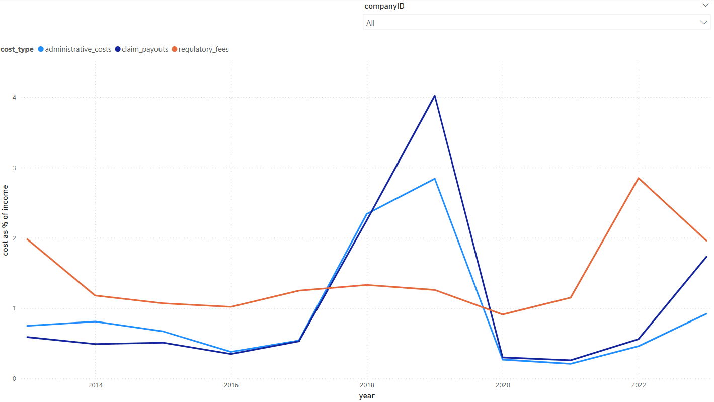

# Cost-Trend-Analysis-PowerBI (2013-2023)
This project presents a trend analysis of three cost categories—**Administrative Costs**, **Claim Payouts**, and **Regulatory Fees**—as a percentage of **Total Assets** over a 10-year period (2013–2023). The goal was to identify cost behavior and its financial impact over time.

## Key Visualizations

### 1. Cost as % of Total Assets (2013–2023)

A line chart displays trends for each cost type over time as a proportion of **total assets**:

- **X-axis**: Year
- **Y-axis**: Cost as % of Total Assets
- **Lines**:
  - Administrative Costs (light blue)
  - Claim Payouts (dark blue)
  - Regulatory Fees (orange)

> 

**Insights**:
- Regulatory Fees are highly volatile and peaked in 2022.
- Administrative and Claim Payouts are relatively stable over the years.

---

### 2. Cost as % of Income (2013–2023)

This chart shows each cost type as a proportion of **income**, which highlights different behavior patterns:

- **X-axis**: Year
- **Y-axis**: Cost as % of Income
- **Lines**:
  - Administrative Costs (light blue)
  - Claim Payouts (dark blue)
  - Regulatory Fees (orange)

> 

**Insights**:
- Claim Payouts and Administrative Costs spiked in 2019, likely due to sudden income disruption.
- Regulatory Fees remained relatively stable but peaked in 2022.

---

## Tools Used

- **Power BI** (Power Query Editor + Visualization)
- Data reshaping using **Unpivot**
- Filtering and trend analysis

---

## Data Preparation Steps

1. **Source Connection**: Connected Power BI to structured Excel/CSV file.
2. **Navigation**: Selected relevant worksheet/table with cost and asset data.
3. **Changed Data Types**:
   - `CompanyID` → Whole Number
   - `total_assets`, `gross_profit` → Decimal Number
   - `year` → Whole Number
4. **Unpivot Columns**:
   - Transformed wide format to long format using “Unpivot Other Columns”.
   - Created a unified “Cost Type” column and corresponding “Value”.
5. **Column Renaming**:
   - `Attribute` → `Cost Type`
   - `Value` → `Cost Value`
6. **Filter**:
   - Removed rows where `Total Premium Collected <= 25`.

---

## Key Insights

- **Regulatory Fees** showed the highest volatility, peaking in 2013 and 2022 (~33–34%), dipping to ~7% in 2019.
- **Administrative Costs** declined from ~8% to ~3%, suggesting increased operational efficiency.
- **Claim Payouts** remained stable, ranging between 3% and 5%.

---

## Author

Jay Chaudhary  
*Data Analyst
